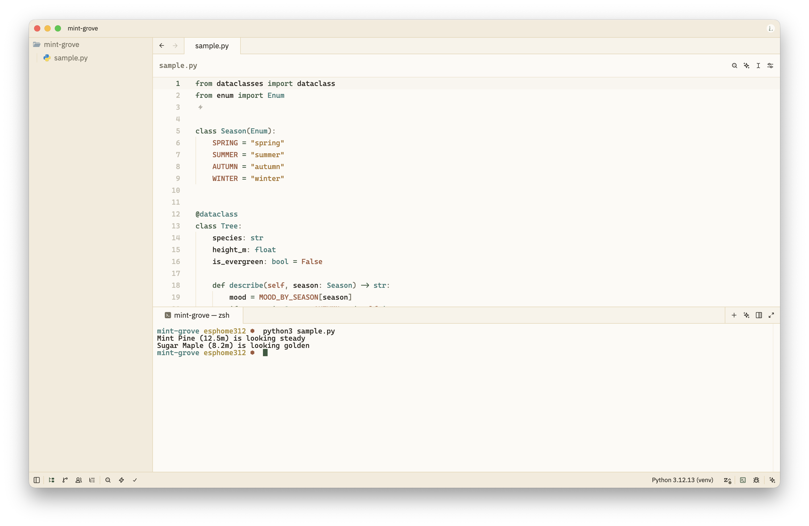
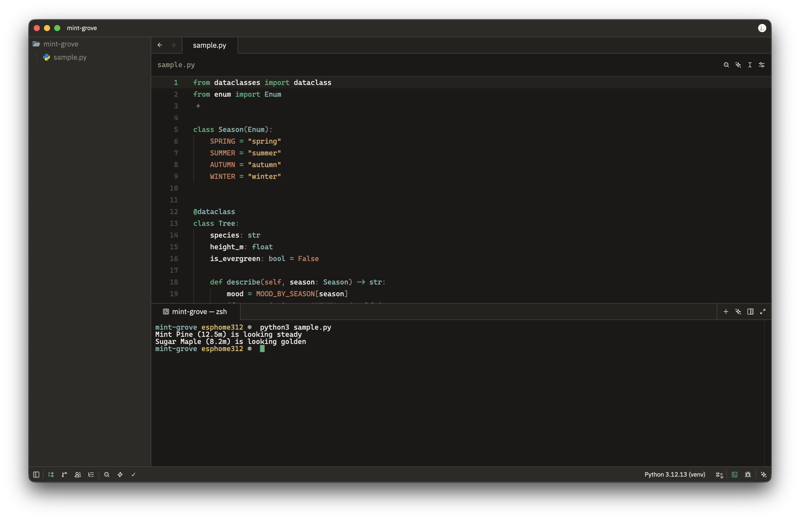

# Forest Mint

A warm forest-green theme for [Zed](https://zed.dev), with light and dark variants.

## Screenshots

## Installation

Install from Zed: open the command palette (`cmd-shift-p` / `ctrl-shift-p`) and run `zed: extensions`, then search for **Forest Mint**.

Or install manually by cloning this repo and loading it as a dev extension via `zed: install dev extension`.

## Themes

- **Forest Mint Light**: warm cream background, deep forest-green accents
- **Forest Mint Dark**: near-black background, bright mint-green accents

Switch theme via the command palette: `theme selector: toggle`.

## Development

This is a Zed theme extension. `extension.toml` declares the extension metadata; `themes/forest-mint.json` holds the theme definitions (Zed theme schema `v0.2.0`).

To iterate locally, load this directory as a dev extension in Zed and reload after editing the JSON.

## License

MIT
